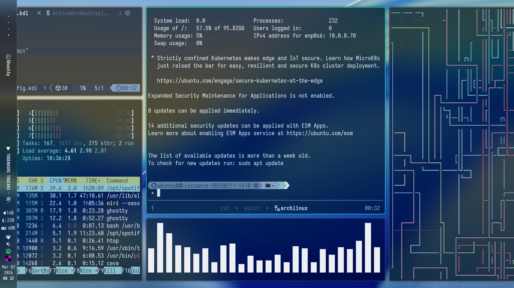

# Dotfiles

## Screenshot



## Dependencies

- stow - symlink farm manager used for managing dotfiles
- [niri][niri] - scrollable-tiling Wayland compositor
- [quickshell][quickshell] - shell UI (bar, launcher, wallpaper)
- [ghostty][ghostty] - terminal emulator
- [dunst][dunst] - notification daemon
- [swaylock][swaylock] - lockscreen
- [nautilus][nautilus] - file manager
- [Zen Browser][zen-browser] - firefox-based browser
- [zsh][zsh]
- [starship][starship] - cross-shell prompt
- [neovim][neovim] - vim-like terminal editor
- [tmux][tmux] - terminal multiplexer
- [brightnessctl][brightnessctl]
- [networkmanager][networkmanager] - `nmcli` for network widget
- [pipewire][pipewire] - audio and video processing engine
- [wireplumber][wireplumber] - provides `wpctl`
- [playerctl][playerctl] - media key controls
- [jq][jq] - used by niri helper script
- qt6-wayland
- aur/ttf-sarasa-gothic-nerd-fonts - or manually install only needed fonts from [here][sarasa-font-release]

Optional:
- [hyprpolkitagent][hyprpolkitagent] - started by niri config for polkit prompts

> [!NOTE]
> I installed `aur/niri-wip-git` for [blur support](https://github.com/niri-wm/niri/pull/3483). If the feature is merged to upstream, you can install it instead.

## Stow Package Lists

- zsh
- starship - starship prompt configuration
- neovim - [LazyVim][lazyvim] configuration
- tmux - nord color theme configuration
- dunst - notification configuration
- ghostty - terminal configuration
- niri - niri WM configuration
- quickshell - bar/launcher/wallpaper configuration

## Getting Started

### Clone

```sh
git clone https://github.com/wtchrs/dotfiles
cd dotfiles
```

### Apply Stow Packages

```sh
stow package_name
```

### Remove Stow Packages

```sh
stow -D package_name
```

### Example Setup

```sh
stow zsh starship neovim tmux dunst ghostty niri quickshell
```

### Niri Configurations

> [!WARNING]
> Before launching niri, review environment and monitor output settings in:
> - `niri/.config/niri/config.kdl`


[brightnessctl]: https://github.com/Hummer12007/brightnessctl
[dunst]: https://github.com/dunst-project/dunst
[ghostty]: https://github.com/ghostty-org/ghostty
[hyprpolkitagent]: https://github.com/hyprwm/hyprpolkitagent
[jq]: https://github.com/jqlang/jq
[lazyvim]: https://github.com/LazyVim/LazyVim
[nautilus]: https://apps.gnome.org/Nautilus/
[neovim]: https://github.com/neovim/neovim
[niri]: https://github.com/niri-wm/niri
[networkmanager]: https://networkmanager.dev/
[playerctl]: https://github.com/altdesktop/playerctl
[pipewire]: https://pipewire.org/
[quickshell]: https://quickshell.org/
[sarasa-font-release]: https://github.com/jonz94/Sarasa-Gothic-Nerd-Fonts/releases
[swaylock]: https://github.com/swaywm/swaylock
[starship]: https://github.com/starship/starship
[tmux]: https://github.com/tmux/tmux
[wireplumber]: https://pipewire.pages.freedesktop.org/wireplumber/
[zen-browser]: https://github.com/zen-browser/desktop
[zsh]: https://github.com/zsh-users/zsh
