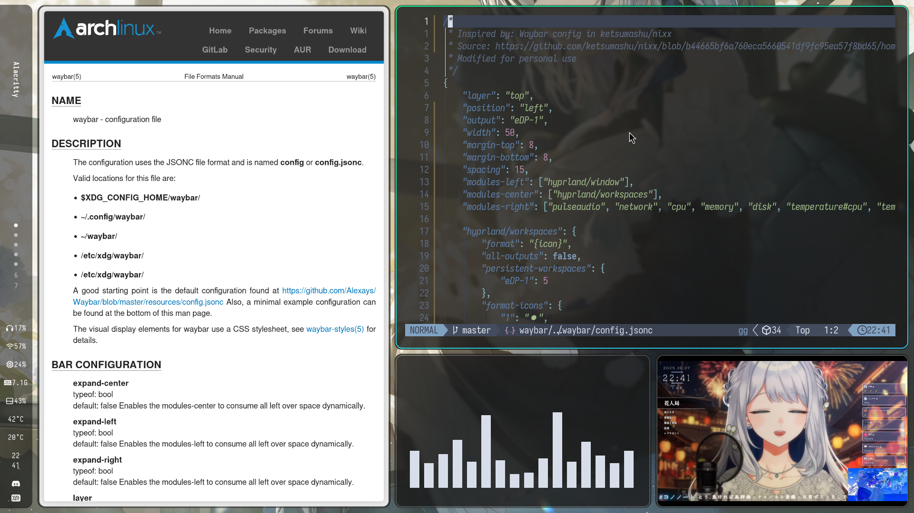

# Hyprland Dotfiles

## Screenshot



## Dependencies

- stow - symlink farm manager used for managing dotfiles
- [hyprland][hyprland] - dynamic tiling WM
- [xdg-desktop-portal-hyprland][xdg-desktop-portal-hyprland]
- [hyprpaper][hyprpaper] - wallpaper
- [hyprlock][hyprlock] - lockscreen
- [wlogout][wlogout] - Wayland-based logout menu
- [waybar][waybar] - GTK status bar for Wayland
- [alacritty][alacritty] - cross-platform OpenGL terminal emulator
- [rofi-wayland][rofi-wayland] - forked version of [rofi][rofi] for Wayland support
- [dunst][dunst] - notification daemon
- [thunar][thunar] - file manager
- [Zen Browser][zen-browser] - firefox-based browser
- [zsh][zsh]
- [starship][starship] - cross-shell prompt
- [neovim][neovim] - vim-like terminal editor
- [tmux][tmux] - terminal multiplexer
- [fastfetch][fastfetch] - neofetch-like system information tool
- [brightnessctl][brightnessctl]
- [networkmanager][networkmanager]
- [pipewire][pipewire] - audio and video processing engine
- [wireplumber][wireplumber] - PipeWire manager
- [mpd-mpris][mpd-mpris] - for displaying now-playing media information on waybar
- qt5-wayland
- qt6-wayland
- ttf-font-awesome
- ttf-fira-sans
- ttf-fira-code
- aur/ttf-sarasa-gothic-nerd-fonts - or manually install only the fonts you need from [here][sarasa-font-release]

## Stow Package Lists

- zsh
- starship - starship prompt configuration
- neovim - [LazyVim][lazyvim] configuration
- tmux - nord color theme configuration
- hyprland - Hyprland WM configuration
- waybar - status bar configuration
- wlogout - power menu configuration
- rofi - application launcher
- dunst - notification configuration
- alacritty - nord color theme with sarasa Mono Nerd Fonts

## Getting Started

### Clone

```sh
git clone https://github.com/wtchrs/dotfiles
cd dotfiles
```

### Apply Stow Packages

```sh
stow package_name
```

### Remove Stow Packages

```sh
stow -D package_name
```

### Hyprland Configurations

Before launching Hyprland, you may need to modify its environment and monitor settings
(see more about Nvidia-specific configurations [here][hyprland-nvidia]).
You can find environment settings in `hyprland/.config/hypr/conf/environments.conf` and
monitor settings in `hyprland/.config/hypr/conf/monitor.conf`.

## Credits

Configuration inspired by [mylinuxforwork/hyprland-starter][hyprland-starter] and [HyDE-Project/HyDE][HyDE].

Vertical Waybar configuration inspired by [this article](https://www.reddit.com/r/unixporn/comments/1caym4z/hyprland_vertical_bar_is_good/), with its source available [here](https://github.com/ketsumashu/nixx/blob/b44665bf6a760eca5660541df9fc95ea57f8bd65/home/waybar/default.nix).


[alacritty]: https://github.com/alacritty/alacritty
[brightnessctl]: https://github.com/Hummer12007/brightnessctl
[dunst]: https://github.com/dunst-project/dunst
[fastfetch]: https://github.com/fastfetch-cli/fastfetch
[HyDE]: https://github.com/HyDE-Project/HyDE
[hyprland]: https://github.com/hyprwm/Hyprland
[hyprland-nvidia]: https://wiki.hyprland.org/Nvidia/
[hyprland-starter]: https://github.com/mylinuxforwork/hyprland-starter
[hyprlock]: https://github.com/hyprwm/hyprlock
[hyprpaper]: https://github.com/hyprwm/hyprpaper
[lazyvim]: https://github.com/LazyVim/LazyVim
[mpd-mpris]: https://github.com/natsukagami/mpd-mpris
[neovim]: https://github.com/neovim/neovim
[networkmanager]: https://networkmanager.dev/
[pipewire]: https://pipewire.org/
[rofi-wayland]: https://github.com/lbonn/rofi
[rofi]: https://github.com/davatorium/rofi
[sarasa-font-release]: https://github.com/jonz94/Sarasa-Gothic-Nerd-Fonts/releases
[starship]: https://github.com/starship/starship
[thunar]: https://github.com/neilbrown/thunar
[tmux]: https://github.com/tmux/tmux
[waybar]: https://github.com/Alexays/Waybar
[wireplumber]: https://pipewire.pages.freedesktop.org/wireplumber/
[wlogout]: https://github.com/ArtsyMacaw/wlogout
[xdg-desktop-portal-hyprland]: https://github.com/hyprwm/xdg-desktop-portal-hyprland
[zen-browser]: https://github.com/zen-browser/desktop
[zsh]: https://github.com/zsh-users/zsh
